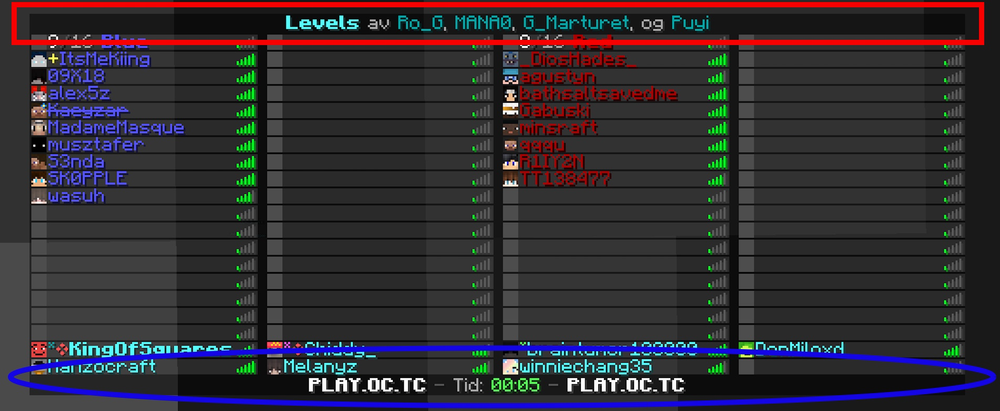

===================
PlayerList/Tab list
===================

Adventure only supports changing the header (above the players) and footer (below the players) of the tab list.

**Usage**

With any :java:`Audience` use :java:`Audience.sendPlayerListHeader(Component)`, :java:`Audience.sendPlayerListFooter(Component)`
and/or :java:`Audience.sendPlayerListHeaderAndFooter(Component, Component)`.

Whether sending a header or footer by itself will display another existing header or footer will vary depending on which platform
you are working on. Servers will most likely support keeping headers or footers when sending them separately, while proxies are
more likely to only let you send everything at once.

**Examples**

.. code-block:: java

    public void onPlayerJoin(final Audience player) {
        final Component header = Component.text("My Cool Server", NamedTextColor.BLUE);
        final Component footer = Component.text("It is: today!");
        player.sendPlayerListHeaderAndFooter(header, footer);
    }

Depending on your platform this next example might display an existing header as well

.. code-block:: java

    public void onDayChange(final Audience server) {
        final Component footer = Component.text("It is: tomorrow!");
        server.sendPlayerListFooter(footer);
    }
